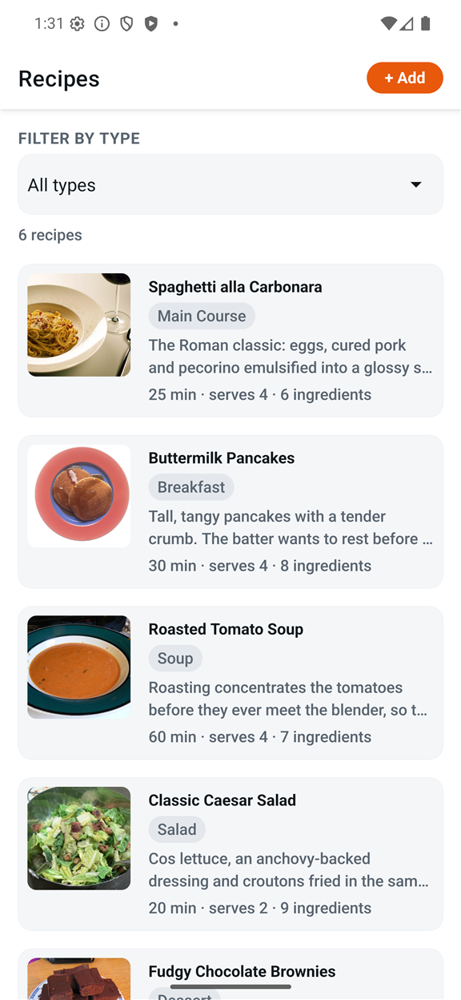
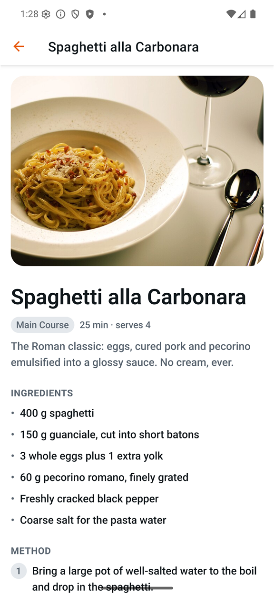
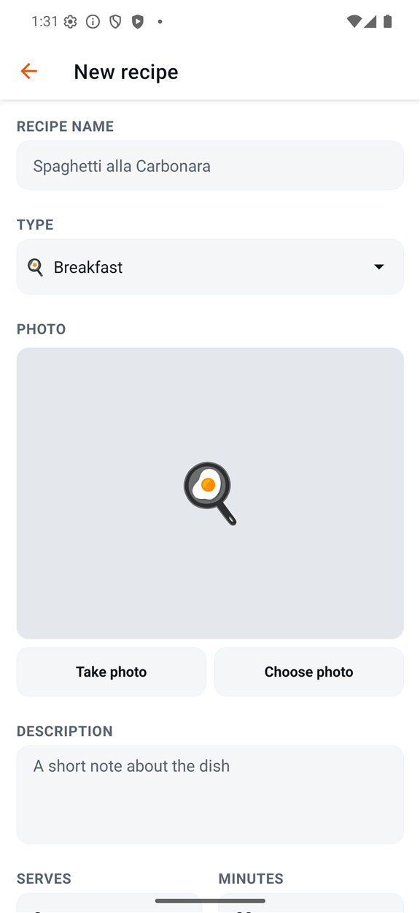
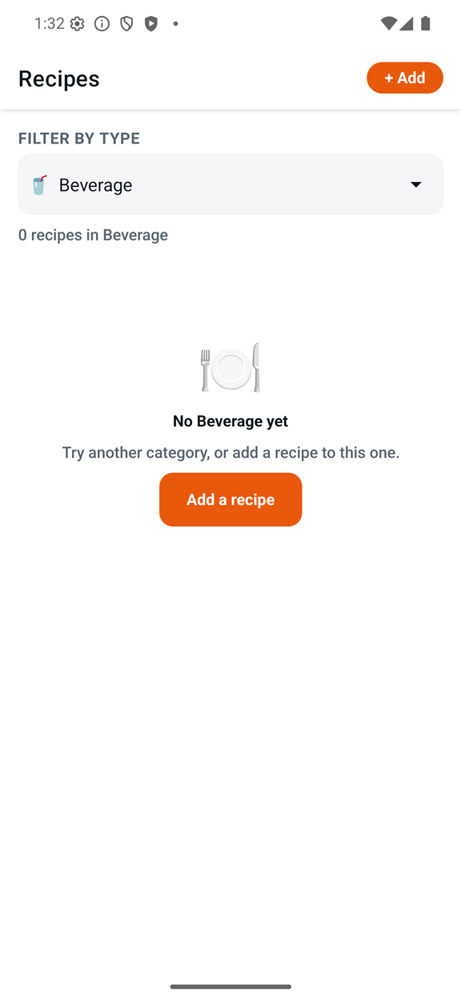
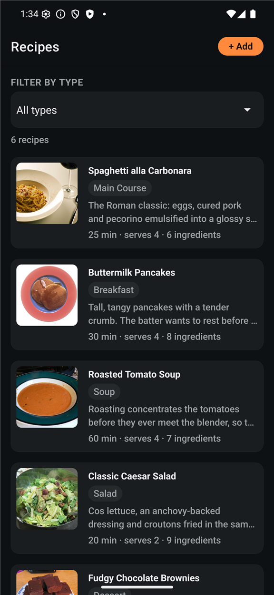
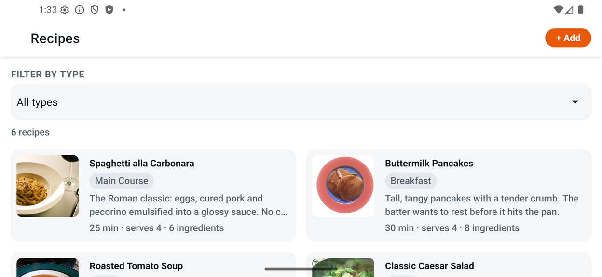
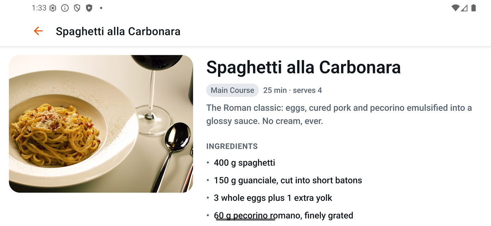

# RecipeApp

A React Native recipe manager built with **Expo SDK 57** and **TypeScript**.

Browse a collection of recipes, filter them by type, add your own with a photo,
ingredients and method steps, then edit or delete them. Everything is stored
on-device and survives an app restart.

Repository: <https://github.com/danishayman/RecipeApp>

---

## Screenshots

| Listing with type filter                        | Recipe detail                                    | Add recipe                                        |
| ----------------------------------------------- | ------------------------------------------------ | ------------------------------------------------- |
|  |  |  |

| Empty category                                       | Dark mode                                       |
| ---------------------------------------------------- | ----------------------------------------------- |
|  |  |

Landscape reflows to a two-column grid, and the detail screen puts the photo
beside the text rather than above it:





---

## Getting started

### Requirements

- **Node.js 20+**
- An **Android emulator** (Android Studio) or **iOS simulator** (Xcode, macOS
  only), or the [Expo Go](https://expo.dev/go) app on a physical device

No custom native build is needed: every native module used here
(`expo-image-picker`, `@react-native-picker/picker`,
`@react-native-async-storage/async-storage`, `expo-file-system`) ships inside
Expo Go.

### Run it

```bash
git clone https://github.com/danishayman/RecipeApp.git
```

```bash
cd RecipeApp && npm install
```

```bash
npx expo start
```

Then press `a` for Android, `i` for iOS, or scan the QR code with Expo Go.

### Scripts

| Script                 | Purpose                     |
| ---------------------- | --------------------------- |
| `npm start`            | Start the Metro dev server  |
| `npm run android`      | Start and open on Android   |
| `npm run ios`          | Start and open on iOS       |
| `npm run web`          | Start and open in a browser |
| `npm run lint`         | ESLint                      |
| `npm run typecheck`    | `tsc --noEmit`              |
| `npm run format`       | Prettier, write             |
| `npm run format:check` | Prettier, check only        |

Lint, typecheck and format all pass with no warnings.

---

## How it is put together

```
src/
  app/                    Expo Router routes (file-based navigation)
    _layout.tsx           Root stack, theme, providers, error boundary
    index.tsx             Recipe listing + type filter
    add.tsx               Add Recipe
    recipe/[id].tsx       Recipe detail, edit mode, delete
  components/             Presentational components, one job each
  constants/theme.ts      Design tokens: colours, spacing, radii, breakpoints
  data/
    recipetypes.json      Source of truth for recipe categories
    sample-recipes.json   Pre-populated recipes
    recipe-catalog.ts     Validated, frozen catalog + lookups
    recipe-factory.ts     Id/timestamp generation, draft normalisation
    recipe-form.ts        Form value shape, validation, draft conversion
    validation.ts         Runtime type guards
  hooks/                  useTheme, useLayout
  state/                  RecipesProvider: the in-memory collection
  storage/
    key-value-store.ts    KeyValueStore interface over AsyncStorage
    recipe-repository.ts  All reads/writes, seeding, versioned keys
    photo-storage.ts      Copies picked photos into permanent storage
  types/recipe.ts         Recipe / RecipeType / RecipeDraft
```

### Data flow

`recipetypes.json` → `recipe-catalog` → the Picker on every screen. The list
filter and both forms read the same catalog, so they cannot drift apart.

`RecipeRepository` owns device storage: JSON encoding, namespaced and
versioned keys, and first-launch seeding. `RecipesProvider` holds the
collection in memory so the listing, add and detail screens all mutate one
array rather than refetching on focus.

### Decisions worth calling out

**Expo rather than the bare React Native CLI.** The assessment prefers the CLI.
This repository was scaffolded with Expo SDK 57 and its `AGENTS.md` pins the
project to the Expo v57 documentation, so the existing toolchain was kept. The
navigation, storage, picker and camera work is the same either way; only the
build tooling differs.

**Seeding is guarded by a separate flag key.** If the seeded marker lived in
the recipe list itself, a user who deleted every recipe would have the samples
reappear on the next launch. A dedicated `recipeapp:seeded:v1` key keeps
"first launch" and "deliberately empty" distinct.

**Picked photos are copied into the document directory.** The image picker
returns a URI inside the app's _cache_ directory, which the OS may purge. The
copy in `photo-storage.ts` is what makes a photo outlive a restart alongside
the recipe. Replacing a photo or deleting a recipe removes the orphaned file.

**Everything read back is validated.** Bundled JSON and stored JSON both pass
through runtime guards. A malformed record is dropped rather than crashing a
screen, and unparseable storage degrades to an empty list with a working
"Add a recipe" action.

**Sample photos are remote URLs.** The six seeded recipes point at
Creative-Commons images on Wikimedia Commons. On a device with no network they
fall back to a category-emoji tile rather than an empty box. Photos the user
adds are local files and always render.

---

## Assessment requirements

| Requirement                                                                         | Where                                                                                                                             |
| ----------------------------------------------------------------------------------- | --------------------------------------------------------------------------------------------------------------------------------- |
| `recipetypes.json` local file drives a Picker/Spinner                               | `src/data/recipetypes.json` → `recipe-catalog.ts` → `RecipeTypePicker`                                                            |
| Listing page, filterable by recipe type                                             | `src/app/index.tsx`                                                                                                               |
| Pre-populated sample recipes complying with `recipetypes.json`                      | `src/data/sample-recipes.json`, validated against the catalog at load                                                             |
| Add Recipe page: picture, ingredients, steps; updates the list                      | `src/app/add.tsx` + `RecipeForm`, `PhotoField`, `DynamicListField`                                                                |
| Recipe Detail page: image, ingredients, steps; all fields editable; update + delete | `src/app/recipe/[id].tsx`                                                                                                         |
| At least one persistence method; data survives restart                              | AsyncStorage via `RecipeRepository`; photos via `expo-file-system`                                                                |
| Public git host, builds from a clean clone                                          | This repository                                                                                                                   |
| HCI-sound UI, adapts to screen size/orientation, respects safe area                 | `useLayout`, safe-area insets, tokens in `constants/theme.ts`                                                                     |
| No crashes during normal use                                                        | Error boundaries, runtime guards — see testing below                                                                              |
| OOP principles, consistent naming and formatting                                    | `RecipeRepository` class over an injectable `KeyValueStore`; ESLint + Prettier                                                    |
| Proper lifecycle and state management                                               | Hooks throughout; `RecipesProvider` context; no `setState` cascades (lint-enforced)                                               |
| At least one third-party library used deliberately                                  | `@react-native-async-storage/async-storage`, `@react-native-picker/picker`, `expo-image-picker`, `expo-file-system`, `expo-image` |

---

## Testing

Verified by hand on an **Android emulator** (Pixel 7 Pro, API level of the
installed system image, via Expo Go):

- first launch seeds six recipes; force-stop and relaunch reads the same six
  back without re-seeding
- filtering by every category, including one with no recipes (empty state)
- adding a recipe: incomplete submission shows per-field errors and blocks the
  save; a complete one appears in the list immediately and survives a restart
- opening a recipe, editing the title, saving, and deleting with confirmation
- portrait and landscape, including rotation while the list is on screen
- dark mode
- a forced render error shows the recovery screen with the listing intact
  beneath it
- invalid JSON in storage degrades to an empty list rather than crashing

**Not tested on iOS.** This project was developed on Windows, so no iOS
simulator was available. Nothing in the app is Android-specific — the only
platform branches are picker sizing and keyboard-avoidance behaviour — but the
iOS run is genuinely unverified and should be treated as such.

---

## Bonus items

None attempted. The optional extras in the brief — extracted reusable hooks
beyond what the app needed, authentication with session persistence, a
networking layer, and Redux/MobX — were left out deliberately to keep the
submission within its time budget.

---

## Licence

See [LICENSE](LICENSE).
